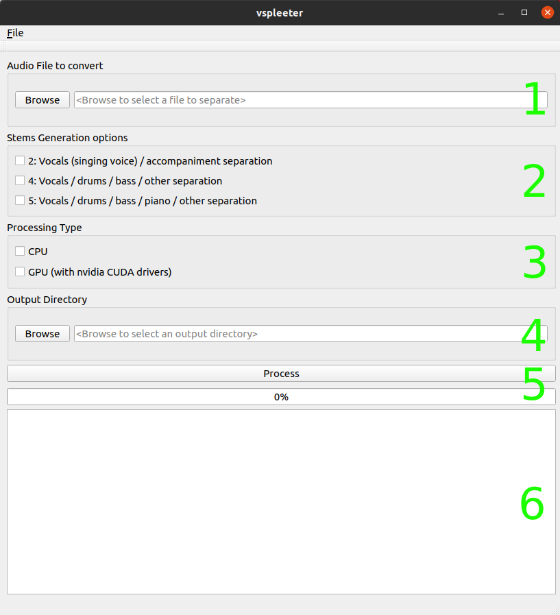

# VSPLEETER

GUI wrapper for the spleeter separate cmd line

### Raison d'être:
I was made aware that a specific tool existed to separate audio tracks using python. As a personal challenge, I wanted to create a small GUI that would minimize shell usage for unsavy audiophiles, and allowing to execute multiple commands in a single operation, instead of having to queue them manually.  

### Interface Overview:

##### 1- Audio Media to separate
Browse to the path of the file

##### 2- Stem options
Select how you desire your audio file to be spleeted. 
Note: You can select multiple options at once.

##### 3- Processing Types
Select if you will run the process in CPU or GPU mode (nvidia CUDA drivers mandatory)
Note: CPU should always work, as long as you are in the right spleeter environment. As for GPU, you need to install them on your own.
As well, you can select multiple options at once.

##### 4- Result directory
Browse to the location where you want to result files to be.

##### 5- Process Button and Progress Bar
Execute the operations by clicking the button. The progress bar will update as the process are being executed

##### 6- Result Log output
Cleaned operation output log

### Usage

##### Easy Steps
Select the file to separate

Select which stems options you want.

Select the processing type you want to use

Browse the output directory as /var/tmp

Press the process button

##### Expected Result
Once the Process button is pressed, all the required operations will be running in your shell.
All the output directories will then be listed.